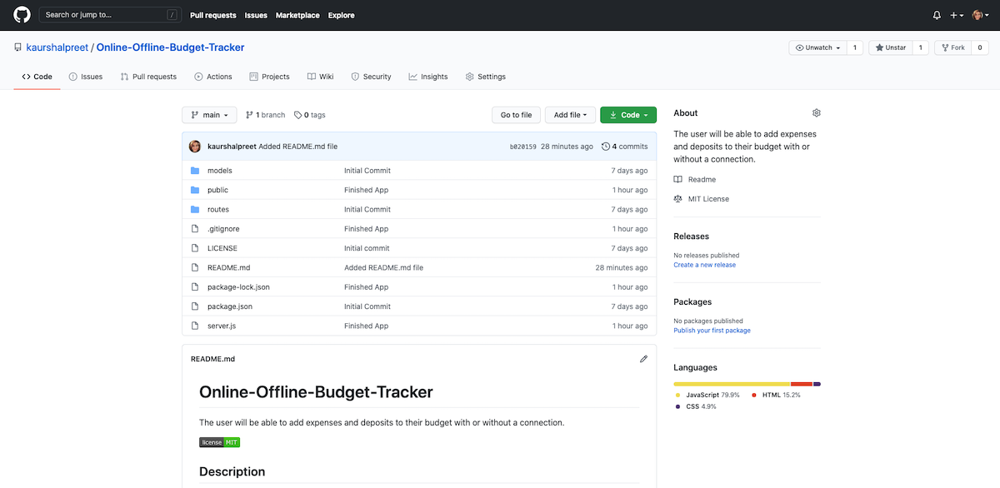

# Online-Offline-Budget-Tracker
The user will be able to add expenses and deposits to their budget with or without a connection.

## Description

Online/Offline Budget Tracker is an app where user will be able to add expenses and deposits to their budget with or without a data/internet connection. When entering transactions offline, they should populate the total when brought back online. So, a user will be able to track their withdrawals and deposits with or without a data/internet connection and check if their account balance is accurate when they are traveling.
 
Giving users a fast and easy way to track their money is important, but allowing them to access that information anytime is even more important. Having offline functionality is paramount to the applications success.  

[The Link to My Github Repository](https://github.com/kaurshalpreet/Online-Offline-Budget-Tracker)

---

## Table of Contents

1. [Usage](#Usage)
1. [Credits](#Credits)
1. [License](#License)

---

## Usage

GIVEN a user is on Budget App without an internet connection
WHEN the user inputs a withdrawal or deposit
THEN that will be shown on the page, and added to their transaction history when their connection is back online. 
The application uses progressive web app functionality. The application also uses manifests and web services that allows the user to have the functionlity without being connected to the internet and will save the information that was inserted for when the device is reconnected to the internet. 

 [The link to the deployed app to Heroku](https://ancient-earth-94263.herokuapp.com/)

A Screenshot of the app is shown below.

---

## Credits

- UC Davis BootCamp - Instructors and TAs
- https://www.w3schools.com/
- https://www.youtube.com/
- https://www.google.com/
- https://choosealicense.com/licenses/
- https://shields.io/category/license

---

## License

#### This application is licensed under the [MIT License](https://opensource.org/licenses/MIT)

---

## Questions

#### You can reach me via my [Github](https://github.com/kaurshalpreet) account.

#### Email me with any additional questions at: kaurshalpreet@gmail.com